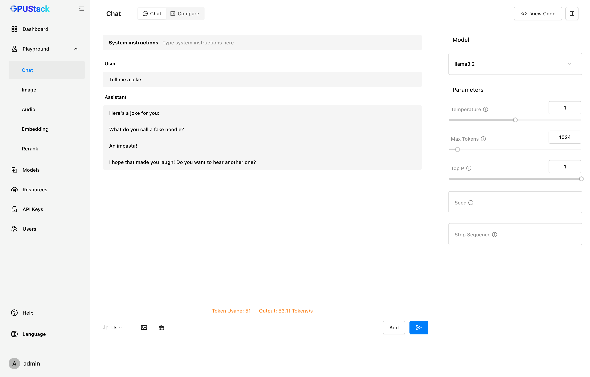

# Guickstart

## Installation

### Linux or MacOS

GPUStack provides a script to install it as a service on systemd or launchd based systems. To install GPUStack using this method, just run:

```bash
curl -sfL https://get.gpustack.ai | sh -s -
```

Optionally, you can add extra workers to form a GPUStack cluster by running the following command on other nodes (replace `http://myserver` and `mytoken` with your actual server URL and token):

```bash
curl -sfL https://get.gpustack.ai | sh -s - --server-url http://myserver --token mytoken
```

In the default setup, you can run the following to get the token used for adding workers:

```bash
cat /var/lib/gpustack/token
```

### Windows

Run PowerShell as administrator, then run the following command to install GPUStack:

```powershell
Invoke-Expression (Invoke-WebRequest -Uri "https://get.gpustack.ai" -UseBasicParsing).Content
```

Optionally, you can add extra workers to form a GPUStack cluster by running the following command on other nodes (replace `http://myserver` and `mytoken` with your actual server URL and token):

```powershell
Invoke-Expression "& { $((Invoke-WebRequest -Uri 'https://get.gpustack.ai' -UseBasicParsing).Content) } -server-url http://myserver -token mytoken"
```

In the default setup, you can run the following to get the token used for adding workers:

```powershell
Get-Content -Path "$env:APPDATA\gpustack\token" -Raw
```

### Manual Installation

For manual installation or detailed configurations, refer to the [installation](installation/manual-installation.md) docs.

## Getting Started

1. Run and chat with the llama3 model:

```bash
gpustack chat llama3 "tell me a joke."
```

2. Open `http://myserver` in the browser to access the GPUStack UI. Log in to GPUStack with username `admin` and the default password. You can run the following command to get the password for the default setup:

**Linux or MacOS**

```bash
cat /var/lib/gpustack/initial_admin_password
```

**Windows**

```powershell
Get-Content -Path "$env:APPDATA\gpustack\initial_admin_password" -Raw
```

3. Click `Playground` in the navigation menus. Now you can chat with the LLM in the UI playground.



4. Click `API Keys` in the navigation menus, then click the `New API Key` button.

5. Fill in the `Name` and click the `Save` button.

6. Copy the generated API key and save it somewhere safe. Please note that you can only see it once on creation.

7. Now you can use the API key to access the OpenAI-compatible API. For example, use curl as the following:

```bash
export GPUSTACK_API_KEY=myapikey
curl http://myserver/v1-openai/chat/completions \
  -H "Content-Type: application/json" \
  -H "Authorization: Bearer $GPUSTACK_API_KEY" \
  -d '{
    "model": "llama3",
    "messages": [
      {
        "role": "system",
        "content": "You are a helpful assistant."
      },
      {
        "role": "user",
        "content": "Hello!"
      }
    ],
    "stream": true
  }'
```
